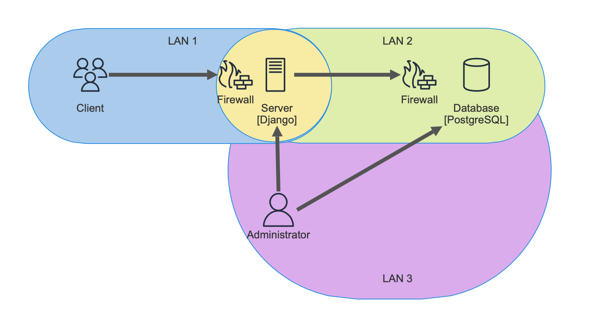

# Secure Cat Adoption Website

This is a simple web application that allows users to browse and adopt cats. The site supports three types of users: **guest**, **logged-in users**, and **administrators**. Guests can browse the available cats for adoption, logged-in users can submit adoption requests, and administrators can manage cats and review adoption requests.

## Features

- **User Roles**:
  - **Guest**: Can browse the list of available cats.
  - **Logged-in User**: Can browse cats, submit adoption requests.
  - **Administrator**: Has full access to the system, can manage cats and review adoption requests.
  
- **cat Management**: Administrators can add, update, or delete cats available for adoption.
- **Adoption Requests**: Logged-in users can submit requests to adopt cats.
- **Responsive UI**: A simple front-end built using HTML, CSS and JS.

## Architecture

- **Frontend**: HTML, CSS, JS
- **Backend**: Django
- **Database**: PostgreSQL


## User Roles and Permissions

- **Guest**:
  - Browse the list of available cats.
  - Access to public information.
  - Submit adoption requests after providing name and email information.

- **Logged-in User**:
  - Has access to all guest functionality.
  - Can submit adoption requests without providing name adn email information.

- **Administrator**:
  - Full access to manage cats (add, update, delete).
  - Can view adoption requests.
  - Has access to the Django admin panel for system management.

## Requirements

- Python 3.11
- Django 5.1
- PostgreSQL

## Security

Additionally, to ensure the security of the application the following measures have been implemented:

- **Network Segmentation**: dividing the network into 3 subnets: public subnet, application subnet and administrative subnet 
- **Secure Password Storage**: database passwords stored in .env file
- **Django Security Mechanisms**:
    - CSRF Token Management
    - Session Management
    - Password Hashing: PBKDF2 algorithm with SHA-256
    - Password Validation
- **Port Number Change**s: changing default SSH port numbers 
- **Admin Path Security**: /admin path is only accessible from the admin machine
- **SSL Certificates**
- **Database Security**

Furthermore, various security scans, using tools like **Nessus**, **OpenVAS**, **OWASP ZAP**, and **Lynis**, were conducted to identify and mitigate potential vulnerabilities, ensuring a more secure application.

## Installation and Setup

1. **Clone the repository**:

   ```bash
   git clone https://github.com/your-username/cat-adoption.git
   cd cat-adoption
